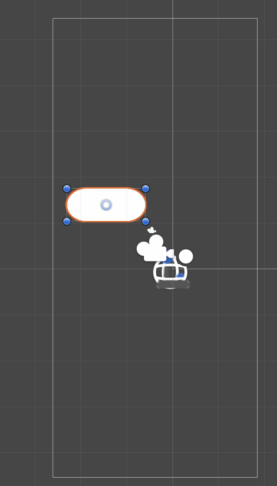
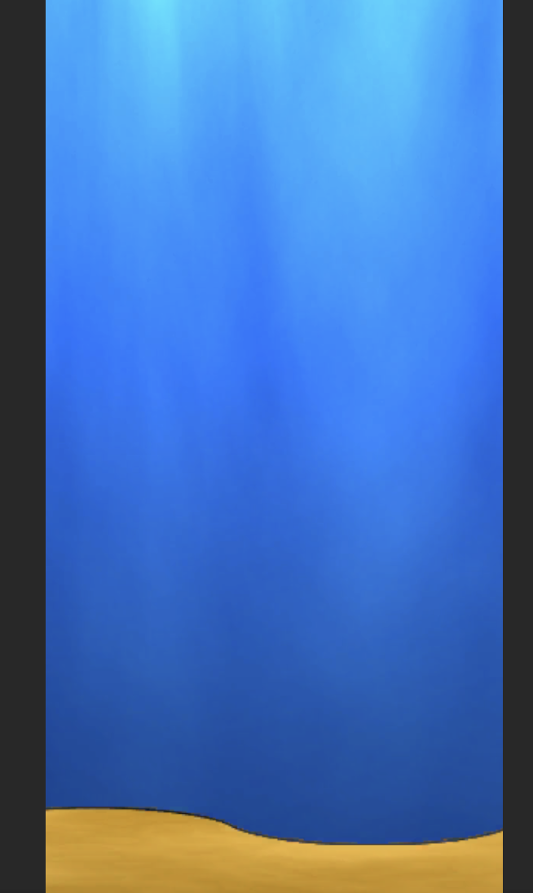
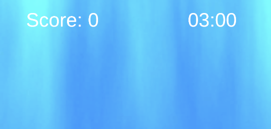
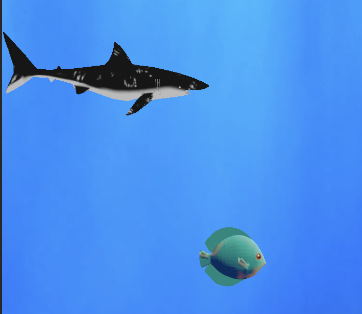
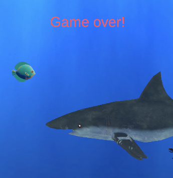

# Arbeitsdokumentation: 2D Shark Adventure (Android)

- **Projekt:** 2D Mobile Game
- **Engine:** Unity (2D-Vorlage)
- **Plattform:** Android
- **Zielsprache:** C#

---

## 1. Projektidee

Inspiriert von Flappy Bird und Hungry Shark wollte ich ein spassiges 2D-Spiel entwickeln, bei welchem der User einen Hai spielt, welcher vorwärts schwimmt, Fische fressen kann und Objekten ausweichen muss. Mein Ziel war es, dass das Spiel einhändig auf einem Smartphone mit dem Touchscreen bedient werden kann.

---

## 2. Kernfunktionen & Komponenten

| Bereich                | Implementierung / Komponenten                         | Beschreibung                                                                                                                                     |
| :--------------------- | :---------------------------------------------------- | :----------------------------------------------------------------------------------------------------------------------------------------------- |
| **Spieler (Hai)**      | `HaiController.cs`, `Rigidbody2D`, `BoxCollider2D`    | Vorwärtsbewegung via Physik(`linearVelocity`), Auftrieb per UI-Touch-Trigger.                                                                    |
| **Gegner / Fische**    | `Fisch.cs`, `FischSpawner.cs`                         | Spawnen in Intervallen; automatische Zerstörung via `Destroy(transform.root.gameObject)` hinter der Kamera, damit Speicher nicht überfüllt wird. |
| **VFX & SFX**          | `ParticleSystem`, `AudioSource`, `Handheld.Vibrate()` | Partikelexplosion mit Auto-Destruction, Fress-Sounds und Android-Vibration beim Einsammeln.                                                      |
| **Endlos-Hintergrund** | `HintergrundWiederholung.cs`                          | Endloses Kacheln zweier nahtloser Hintergrund-Sprites anhand der Kameraposition (`SpriteRenderer.bounds.size.x`).                                |
| **Game Flow & UI**     | `GameManager.cs`, TextMeshPro (TMP)                   | Punktezähler, 2-Minuten-Countdown, "ZEIT ABGELAUFEN!"-Meldung und Szenenwechsel ins Menü.                                                        |

---

## 3. Schrittweises Vorgehen

### Phase 1: Projekt-Setup & Spieler-Steuerung

1. Unity 2D-Projekt auf die Plattform **Android** umgestellt (Build Settings).
2. Hai-Objekt mit `Rigidbody2D` (Dynamic, Freeze Rotation Z) und Collider ausgestattet.
3. `HaiController.cs` implementiert:
   - Kontinuierliche Vorwärtsbewegung in `Update()`.
   - Funktion `SchwimmeNachOben()` mit vertikalem Impuls für den Touch-Button.
4. Unsichtbaren Vollbild-Button auf dem UI-Canvas angelegt und mit `SchwimmeNachOben()` verknüpft.

### Phase 2: Spawner- & Despawn-System

1. Fisch-Prefab mit Trigger-Collider und `Fisch.cs` erstellt.
2. `FischSpawner.cs` angelegt, der Fische in Intervallen auf zufälligen Y-Höhen vor der Kamera instanziiert.
3. Cleanup-Logik eingebaut: Sobald ein Fisch 15 Einheiten hinter der Kamera liegt, wird er gelöscht, um Speicherlecks zu verhindern.

### Phase 3: Feedback-System & ScriptableObject

1. Partikelsystem für den Fresseffekt gebaut (Burst-Emission, Color over Lifetime, Auto-Destruction nach 2 Sekunden).
2. Haptisches Feedback für Android mittels `Handheld.Vibrate()` integriert.

Anschliessend war das Spiel mal so ungefähr spielbar, hat jedoch auch noch nicht schön ausgesehen:



### Phase 4: Endlos-Hintergrund & Audio

1. Nahtlose Unterwasser-Grafik importiert und Mesh Type auf _Full Rect_ gesetzt.
2. Zwei Hintergrundobjekte nebeneinander platziert (`Underwater1` & `Underwater2`).
3. `HintergrundWiederholung.cs` geschrieben, das das jeweils hintere Bild automatisch vor die Kamera teleportiert.
4. Musik durfte nicht fehlen. Passend zum Thema habe ich den Song "Sharks" von Imagine Dragons als Hintergrundmusik auf der `Main Camera` als `AudioSource` eingerichtet.

Der Hintergrund machte das Game viel ansprechender:



Zudem machte der Sound das Ganze viel lebendiger.

### Phase 5: Rundenzeit & Menü-Rückkehr

1. UI-Canvas um `TimerText` und `ZeitUmText` (beide TextMeshPro) erweitert.
2. `GameManager.cs` um 120-Sekunden-Timer (2 Minuten) ergänzt.
3. Ablauflogik programmiert: Bei Ablauf der Zeit wird `ZEIT ABGELAUFEN!` eingeblendet, die Eingabe gestoppt und nach 2,5 Sekunden Verzögerung (`Invoke`) die Szene `StartMenu` geladen.



### Phase 6: Hai und Fische verschönert

1. Asset ["Animated Low Poly Animals Pack" von Backrock Studios](https://assetstore.unity.com/packages/3d/characters/animals/animated-low-poly-animals-pack-wolf-horse-shark-more-60-variants-258476) heruntergeladen
2. Endlich von der 2D-Capsule weggekommen und ein Hai-Prefab erstellt
3. Fisch-Prefabs erstellt
4. Animation gem. Assets eingebaut, damit sich Hai und Fische bewegen

Das machte schon viel mehr Laune:



### Phase 7: Highscore auf Menu

Damit es ein bisschen interessanter wird, zeige ich den Highscore neu auf dem Menu an. Das mache ich über "PlayerPrefs", damit die Punktzahl bestehen bleibt.

```csharp
int alterHighscore = PlayerPrefs.GetInt("Highscore", 0);
```

### Phase 8: EnemyShark

Um das Spiel noch ein bisschen unvorgesehener zu machen, habe ich einen EnemyShark hinzugefügt, welcher nach einiger Zeit in die entgegengesetzte Richtung schwimmt:



### Phase 9: Android-Build & Bereitstellung

1. Build Settings: Szenenreihenfolge festgelegt (`0: StartMenu`, `1: Game`).
2. Player Settings konfiguriert (Package Name, Minimum API Level, Architekturen: ARMv7 + ARM64).
3. APK gebaut, auf das Android-Gerät übertragen und getestet.

---

## 4. Problemlösungen & Learnings

- **Audio-Import (.m4a):**
  - _Problem:_ Unity erkannte `.m4a` im Editor nur als Binärdatei ohne Audio-Optionen.
  - _Lösung:_ Datei in standardisiertes / `.wav` konvertiert.

- **APK-Parsing-Fehler bei Installation:**
  - _Problem:_ Android verweigerte die Installation ("Beim Parsen des Pakets ist ein Problem aufgetreten").
  - _Lösung:_ _Minimum API Level_ in den Player Settings auf Android 8.0/9.0 heruntergesetzt und beide Zielarchitekturen (ARM64 & ARMv7) aktiviert.
